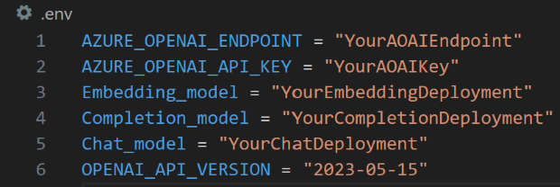
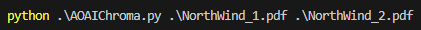
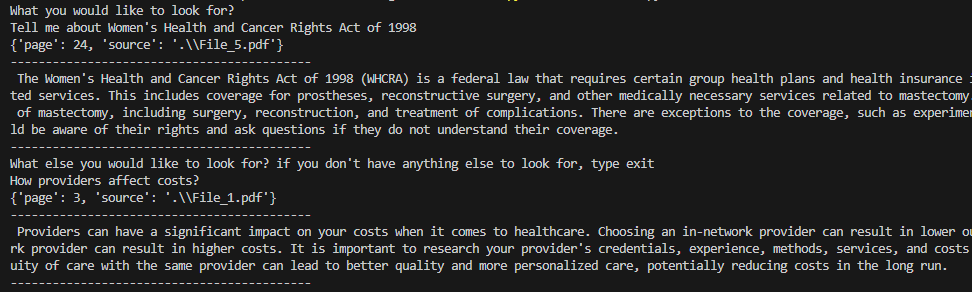

# AOAI-Langchain-ChromaDB
This repo is used to locally query pdf files using AOAI embedding model, langChain, and Chroma DB embedding database. I was inspired by LazaUK repo (https://github.com/LazaUK/AOAI-LangChain-Milvus/tree/main), as he used Milvus vectorDB and stored it through a container. My repo is using Chroma vectorDB and stores the embeddings locally. 

## Step 1 - Installing the requirements and gettings things ready 

1. Initally, we would need to install the necessary python libraries for Azure OpenAI, chromadb, langchain, pypdf, and dotenv. 
Run the following command to install all required libraries: 
```
pip install -r requirements.text
```
2. You need to create .env file that will contain all the information related to your Azure OpenAI models.  

Fill out your resource details as shown below:  

  

Then we would load the env varaible and configure the embedding model.
``` Python
load_dotenv()
embedding_function = AzureOpenAIEmbeddings(
    azure_endpoint=os.getenv("AZURE_OPENAI_ENDPOINT"),
    azure_deployment=os.getenv("Embedding_model"),
    openai_api_version="2023-05-15"
    )
```

## Step 2 - Loading the files and storing it locally 
Created a function that would load the files, embed them, and store it in the chorma_db in the same folder
``` Python
def load_pages():
    # We will be passing the file name as an argument when running the python script
    paths = list(sys.argv[1:])
    
    for path in paths:
        # Load the file and split it into pages. 
        loader = PyPDFLoader(path)
        pages = loader.load_and_split()
        # Here we are saving our vector embedding database on the local storage. 
        Chroma.from_documents(pages, embedding_function, persist_directory=r".\chroma_db")
```
If there are files passed as an arguments with the python script it would be loaded and converted, otherwise it wouldn't load any files: 

``` Python
if len(sys.argv[:]) > 1:
    load_pages()
``` 

## Step 3 - Sending a query and getting results
Created a function to load the chromadb store, use Embedding fuction and return an answer to the query with metadata enabaled. 

``` Python
def search_pages(query):
    # Here we are loading our vector embedding database from the local storage. 
    db = Chroma(persist_directory="./chroma_db", embedding_function=embedding_function)

    # Here we are retrieving the data and chaining it to a completion AI model to summarize.
    rag_chain = RetrievalQA.from_chain_type(
        llm=AzureOpenAI(deployment_name=os.getenv("Completion_model"), openai_api_version="2023-05-15"),
        retriever=db.as_retriever(), 
        return_source_documents=True
    )
    return rag_chain({"query": query})
```
We can pass the pdf files as follows:


Then the terminal would ask us what we are looking for and we get the following output (Contains the source file and the page): 



