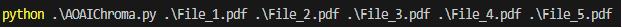

# AOAI-Langchain-ChromaDB

This repo is used to locally query pdf files using AOAI embedding model, langChain, and Chroma DB embedding database. I was inspired by LazaUK repo (https://github.com/LazaUK/AOAI-LangChain-Milvus/tree/main), as he used Milvus vectorDB and stored it through a container. My repo is using Chroma vectorDB and stores the embeddings locally. 

In this repo I will be using Azure OpenAI, ChromaDB, and Langchain to retrieve user's documents.

* [Azure OpenAI](https://learn.microsoft.com/en-us/azure/ai-services/openai/overview) used with ChromaDB to answer user's query and provide the documents used.
* [ChromaDB](https://docs.trychroma.com/getting-started) used to locally create vector embeddings of the provided documents.
* [LangChain](https://python.langchain.com/docs/get_started/introduction) used as the framework for LLM models. 

# Table of contents:
- [Step 1 - Installing the Requirements and Gettings Things Ready](https://github.com/ABDFMSM/AOAI-Langchain-ChromaDB?tab=readme-ov-file#step-1---installing-the-requirements-and-gettings-things-ready)  
- [Step 2 - Loading Files and Storing it Locally](https://github.com/ABDFMSM/AOAI-Langchain-ChromaDB?tab=readme-ov-file#step-2---loading-the-files-and-storing-it-locally)  
- [Step 3 - Sending a Query and Getting Results](https://github.com/ABDFMSM/AOAI-Langchain-ChromaDB?tab=readme-ov-file#step-3---sending-a-query-and-getting-results)  
- [Step 4 - Getting User's Query and Providing the Answer with the Source](https://github.com/ABDFMSM/AOAI-Langchain-ChromaDB/tree/main?tab=readme-ov-file#step-4---getting-users-query-and-providing-the-answer-with-the-source)  


## Step 1 - Installing the Requirements and Gettings Things Ready

1. Initally, we would need to install the necessary python libraries for Azure OpenAI, chromadb, langchain, pypdf, and dotenv. 
Run the following command to install all required libraries: 
```
pip install -r requirements.text
```
2. You need to create .env file that will contain all the information related to your Azure OpenAI models.  

Fill out your resource details as shown below:  

  

Then we would load the env varaible and configure the AI models (embedding, completion, chat).
I'll be using the embedding model to create vector database, completion model for the retrieval tool, and chat model for the chat agent. 

``` Python
load_dotenv()
embedding_function = AzureOpenAIEmbeddings(azure_deployment=os.getenv("Embedding_model"))
llm_completion = AzureOpenAI(deployment_name=os.getenv("Completion_model"))
llm_chat = AzureChatOpenAI(deployment_name=os.getenv("Chat_model"), openai_api_version="2023-12-01-preview")
```

## Step 2 - Loading Files and Storing it Locally 
Created a function that would load the files, embed them, and store it in the chorma_db in the same folder
``` Python
def load_pages():
    # We will be passing the file name as an argument when running the python script
    paths = list(sys.argv[1:])
    for path in paths:
        # Load the file and split it into pages. 
        loader = PyPDFLoader(path)
        pages = loader.load_and_split()
        # Here we are saving our vector embedding database on the local storage. 
        Chroma.from_documents(pages, embedding_function, persist_directory=r".\chroma_db")
```
If there are files passed as an arguments with the python script it would be loaded and converted, otherwise it wouldn't load any files: 

``` Python
if len(sys.argv[:]) > 1:
    load_pages()
``` 
We can pass the pdf files as follows:  


## Step 3 - Creating a retrieval tool and a chat Agent: 
Loaded the chromadb store, created a retrieval tool and created chat Agent.
I used a RetrievalQA class to be able to return the source documents. 

``` Python
# Creating a retrieval tool for the agent.
# Here we are loading our vector embedding database from the local storage 
db = Chroma(persist_directory="./chroma_db", embedding_function=embedding_function)
retriever = db.as_retriever()

chain = RetrievalQA.from_chain_type(
    llm=llm_completion, 
    chain_type='stuff', 
    retriever=retriever, 
    return_source_documents=True, 
    input_key="question")

tool = Tool(
    name="search_norhtWind_insurance",
    func=lambda query: chain.invoke({"question": query}),
    description="Use it to answer any questions related to insurance."
)

agent = create_openai_tools_agent(llm_chat, [tool], prompt)
agent_executor = AgentExecutor(agent=agent, tools=[tool], memory=memory, verbose=False)
```

## Step 4 - Getting User's Query and Providing the Answer with the Source
I have created an input_query funtion that uses a while loop to retrieve documents for the user until the type exit. 
``` python
def main(): 
    if len(sys.argv[:]) > 1:
        load_pages()

    question = input("What do you like to ask?\n")

    while "exit" not in question: 
        result = agent_executor.invoke({"input": question})
        print(result['output'])
        question = input("\n")
```

The terminal will keep asking the user what they are looking for and provide the following output (Contains the source file and the page):
One of the GPT feature is the ability to answer in any language used by the user. 


https://github.com/ABDFMSM/AOAI-Langchain-ChromaDB/assets/133496062/fb4606b7-4168-4b67-9294-7480c3b0357e

It takes some time to check the files stored in the vector database. 
You can also see that it takes some time to response to questions asked in a different language (Arabic) 


